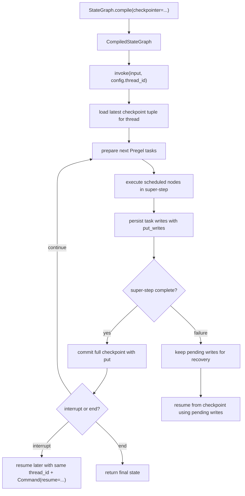

# LangGraph StateGraph compile invoke flow

## Summary

이 페이지는 `StateGraph.compile()`에서 `.invoke()`까지의 실행 흐름을 추적한다. 현재는 checkpointing 관점의 source path가 commit `aa322c13cd5f16a3f6254a931a4104e412cd687c` 기준으로 검증되었다.

핵심 요약: `StateGraph.compile(checkpointer=...)`는 `CompiledStateGraph` runnable을 만들고 checkpointer를 연결한다. 실행 시 `thread_id`가 있으면 LangGraph runtime은 super-step boundary마다 checkpoint를 저장하고, super-step 내부의 task writes도 저장해 interrupt, replay, pending-write recovery를 지원한다.

## Entry Point

```python
from typing import Annotated
from typing_extensions import TypedDict
from operator import add

from langgraph.graph import StateGraph, START, END
from langgraph.checkpoint.memory import InMemorySaver

class State(TypedDict):
    foo: str
    bar: Annotated[list[str], add]

def node_a(state: State):
    return {"foo": "a", "bar": ["a"]}

def node_b(state: State):
    return {"foo": "b", "bar": ["b"]}

workflow = StateGraph(State)
workflow.add_node(node_a)
workflow.add_node(node_b)
workflow.add_edge(START, "node_a")
workflow.add_edge("node_a", "node_b")
workflow.add_edge("node_b", END)

graph = workflow.compile(checkpointer=InMemorySaver())
config = {"configurable": {"thread_id": "1"}}
graph.invoke({"foo": "", "bar": []}, config)
```

Source: `langgraph-docs-persistence-2026-05-20`

## Call Path

### 1. `StateGraph.compile(checkpointer=...)`

**검증됨:** `compile()`은 `StateGraph`를 `CompiledStateGraph` runnable로 만든다. Reference 문서는 `checkpointer`를 graph의 versioned short-term memory로 설명하며, checkpointer가 있으면 invoke config에 `thread_id`를 전달해야 한다고 명시한다. Source: `langgraph-reference-stategraph-compile-2026-05-20`

**검증됨:** source 기준 `compile()`은 `ensure_valid_checkpointer()`를 거친 checkpointer를 `CompiledStateGraph(..., checkpointer=checkpointer, ...)`에 전달한다. 이후 `START`, nodes, edges, waiting edges, branches를 attach하고 `compiled.validate()`를 반환한다. `CompiledStateGraph`는 `Pregel`을 상속한다. Source: `langgraph-source-checkpoint-runtime-2026-05-20`

**검증됨 (부분):** `compiled.validate()`는 `compile()` 마지막 단계로 호출되며 그 결과를 반환한다. 내부 구조 검사 내용은 아직 소스 미수집 상태다. (Needs Source: `_checkpoint.py`, `pregel/main.py validate()` 구현)

### 2. `CompiledStateGraph.invoke(input, config)`

**검증됨:** checkpointer 사용 시 `config["configurable"]["thread_id"]`가 thread key로 사용된다. 이 값이 없으면 checkpointer는 state 저장과 interrupt 이후 resume을 할 수 없다. Source: `langgraph-docs-persistence-2026-05-20`

**검증됨:** config 전달 경로: `graph.invoke(input, config)` → `Pregel._defaults(config)`에서 effective checkpointer 결정 → `SyncPregelLoop(checkpointer, config)` 생성 → `_first()`에서 `checkpointer.get_tuple(config)` 호출 → saver가 `config["configurable"]["thread_id"]`를 primary key로 thread checkpoint 조회. 같은 `thread_id`로 재실행하면 이전 checkpoint 위에서 계속 실행된다(multi-turn 연속성). Source: `langgraph-source-checkpoint-runtime-2026-05-20`, `langgraph-docs-persistence-2026-05-20`

**검증됨:** `Pregel._defaults()`가 effective checkpointer와 durability를 결정한다. `checkpointer=False`는 checkpointing을 끄고, config-level checkpointer override가 있으면 그것을 사용하며, root graph에서 `checkpointer=True`는 오류다. 기본 durability는 `"async"`다. Source: `langgraph-source-checkpoint-runtime-2026-05-20`

**검증됨:** sync 실행에서 `Pregel.stream()`은 `SyncPregelLoop`를 만들고, `PregelRunner`에 `put_writes=loop.put_writes`를 전달한다. 따라서 task output writes는 runner에서 loop의 `put_writes()`로 들어간다. Source: `langgraph-source-checkpoint-runtime-2026-05-20`

### 3. Super-step loop

**검증됨:** LangGraph는 super-step boundary마다 checkpoint를 생성한다. 한 super-step은 현재 예약된 node들이 실행되는 tick이며, node들은 병렬 실행될 수 있다. Source: `langgraph-docs-persistence-2026-05-20`

**검증됨:** source 기준 runtime loop는 `while loop.tick()` 안에서 cached writes를 출력하고, unfinished tasks를 runner로 실행한 뒤, `loop.after_tick()`을 호출한다. `after_tick()`은 `apply_writes()`로 task writes를 checkpoint에 적용하고 `_put_checkpoint({"source": "loop"})`를 호출한다. Source: `langgraph-source-checkpoint-runtime-2026-05-20`

**검증됨 (`_loop.py` 직접 확인 2026-05-24):** `PregelLoop` 세부 구조:
- `status` 전이: `"input"` → `"pending"` → `"done" | "interrupt_before" | "interrupt_after" | "out_of_steps" | "draining"`
- `stop = step + recursion_limit + 1` — recursion_limit이 loop 종료 조건
- `tick()`: step > stop 이면 `"out_of_steps"` 즉시 반환. `prepare_next_tasks()` → tasks 없으면 `"done"`. interrupt_before 조건 충족 시 `GraphInterrupt` raise
- `after_tick()`: `apply_writes()` → `updated_channels` 계산 → `checkpoint_pending_writes.clear()` → `_put_checkpoint({"source": "loop"})` → interrupt_after 검사 → `CONFIG_KEY_RESUMING` 플래그 제거
- `SyncPregelLoop.__enter__`: `checkpointer.get_tuple()` → channels 초기화 → `_first()` 호출 → `status = "input"`
- `SyncPregelLoop._checkpointer_put_after_previous`: delta_write_futs 드레인 후 이전 checkpoint fut 대기 → `checkpointer.put()` 호출 (순서 보장)

Source: `langgraph-venv-loop-py-2026-05-24`

**검증됨:** persistence timing은 실행 시 `durability` 옵션에 따라 달라진다. `"async"`는 기본값이다. `"sync"`는 tick 뒤 `_put_checkpoint_fut.result()`를 기다린다. `"exit"`는 `put_writes()`의 즉시 저장을 건너뛰고 loop exit 시 checkpoint와 pending writes를 저장한다. Source: `langgraph-docs-durable-execution-2026-05-20`, `langgraph-source-checkpoint-runtime-2026-05-20`

Sequential graph `START -> A -> B -> END`의 checkpoint sequence:

1. Empty checkpoint with `START` as next node
2. Input checkpoint with `node_a` as next node
3. `node_a` output checkpoint with `node_b` as next node
4. `node_b` output checkpoint with no next nodes

### 4. Task writes inside a super-step

**검증됨:** full checkpoint 외에도 node/task-level writes가 checkpointer에 저장된다. 한 super-step 안에서 일부 node가 성공하고 다른 node가 실패하면, 성공한 node의 writes를 pending writes로 재사용해 resume 시 성공 node를 다시 실행하지 않을 수 있다. Source: `langgraph-docs-persistence-2026-05-20`, `langgraph-reference-checkpoint-2026-05-20`

**검증됨:** `PregelLoop.put_writes()`는 writes를 `checkpoint_pending_writes`에 추가한다. `durability != "exit"`이고 saver가 있으면 `checkpointer.put_writes()`를 호출한다. Tick 시작 시 pending writes가 있고 replay 중이 아니면 `_reapply_writes_to_succeeded_nodes()`가 호출된다. Source: `langgraph-source-checkpoint-runtime-2026-05-20`

**검증됨 (`_loop.py` 직접 확인 2026-05-24):** `_reapply_writes_to_succeeded_nodes()` 상세:
- `checkpoint_pending_writes` 순회하며 `ERROR`, `ERROR_SOURCE_NODE`, `INTERRUPT`, `RESUME` 채널은 **건너뜀**
- 나머지 writes는 해당 `task.writes`에 복원 → `task.writes`가 비어있지 않으므로 runner가 재실행 skip
- 이것이 partial failure 후 resume에서 성공한 노드가 재실행되지 않는 메커니즘

**검증됨 (`_loop.py` 직접 확인 2026-05-24):** Error handler 흐름:
- `commit()` 시 ERROR_SOURCE_NODE 마커가 `checkpoint_pending_writes`에 기록됨
- Resume 시 `_resume_error_handlers_if_applicable()`: ERROR_SOURCE_NODE+ERROR 쌍 감지 → 원래 task에 `(ERROR, error)` write 추가 (runner skip) → 새 error handler task 준비 + 추가
- `schedule_error_handler()`: `_error_handler_write_futs` 드레인 후 handler task 반환

Source: `langgraph-venv-loop-py-2026-05-24`

### 5. State inspection

**검증됨:** `graph.get_state(config)`는 최신 `StateSnapshot` 또는 특정 `checkpoint_id`의 snapshot을 반환한다. `graph.get_state_history(config)`는 thread의 checkpoint history를 최신순으로 반환한다. Source: `langgraph-docs-persistence-2026-05-20`

**검증됨:** source 기준 `get_state()`는 `checkpointer.get_tuple(config)`를 호출한 뒤 `_prepare_state_snapshot()`으로 `StateSnapshot`을 조립한다. 최신 checkpoint 조회에서는 pending writes를 적용한 snapshot을 만들 수 있다. `get_state_history()`는 `checkpointer.list()` 결과를 snapshot으로 변환한다. Source: `langgraph-source-checkpoint-runtime-2026-05-20`

### 6. Resume / replay

**검증됨:** interrupt resume은 같은 `thread_id`와 `Command(resume=...)`를 사용한다. LangGraph는 Python call stack의 같은 줄에서 계속하지 않고 적절한 시작점부터 replay한다. Graph API에서는 중단된 node의 시작점이 시작점이다. Source: `langgraph-docs-durable-execution-2026-05-20`

**검증됨:** 과거 `checkpoint_id`로 replay하면 checkpoint 이전 node는 skipped 처리되고 이후 node는 다시 실행된다. 이때 LLM call, API request, interrupt도 다시 발생할 수 있다. Source: `langgraph-docs-persistence-2026-05-20`

**검증됨:** source 기준 `_first()`는 기존 checkpoint의 `channel_versions`와 입력 형태(`None`, `Command`, same `run_id`, `CONFIG_KEY_RESUMING`)로 resume 여부를 판정한다. time-travel replay에서는 stale `RESUME` write를 제거하고 필요하면 `source="fork"` checkpoint를 만든다. Source: `langgraph-source-checkpoint-runtime-2026-05-20`

**검증됨 (`_loop.py` 직접 확인 2026-05-24):** `_first()` resume 판정 로직 상세:
- `is_resuming = checkpoint["channel_versions"] 존재 AND (input is None OR input is Command OR same run_id OR CONFIG_KEY_RESUMING)`
- resume 시: `versions_seen[INTERRUPT]` = 현재 채널 버전 → interrupt 노드들이 "이미 처리됨"으로 표시 → 해당 노드들을 건너뜀
- time-travel 감지: `is_replaying AND NOT (Command(resume=...) OR CONFIG_KEY_RESUMING)` → stale RESUME writes 제거 + fork checkpoint 생성
- `input is None` → resume after interrupt (= `invoke(None, config)` 패턴)
- `input is Command` → Command(goto=...) 또는 Command(resume=...) — Command(goto=...) 도 resuming

Source: `langgraph-venv-loop-py-2026-05-24`

### 7. Interrupt 처리

**검증됨:** interrupt가 발생하면 LangGraph는 현재 checkpoint를 저장하고 실행을 중단한다. 두 가지 방식이 있다.

- `interrupt_before/after` — compile() 시 설정. `Pregel.interrupt_before_nodes` / `interrupt_after_nodes`로 저장. 실행 시 override 가능 (`interrupt_before or self.interrupt_before_nodes` 패턴).
- `interrupt()` 함수 — 노드 내부에서 동적 호출. `GraphInterrupt` 예외로 실행 중단. `scratchpad.resume` 인덱스 기반 멱등 설계로, `Command(resume=...)` 재호출 시 `interrupt()`가 resume 값을 반환하며 노드가 계속 실행됨.

재개: `graph.invoke(Command(resume=user_input), config)` 또는 `graph.invoke(None, config)`.

Source: `langgraph-source-pregel-interrupts-2026-05-23`

## Checkpoint Data Shape

Public `StateSnapshot` fields:

- `values` — state channel values
- `next` — next node names
- `config` — `thread_id`, `checkpoint_ns`, `checkpoint_id`
- `metadata` — `source`, node `writes`, `step`
- `created_at` — timestamp
- `parent_config` — previous checkpoint config
- `tasks` — scheduled tasks, errors, interrupts, optional subgraph snapshot

Source: `langgraph-docs-persistence-2026-05-20`

Source-level `Checkpoint` fields:

- `v`
- `id`
- `ts`
- `channel_values`
- `channel_versions`
- `versions_seen`
- `updated_channels`

Source: `langgraph-source-checkpoint-runtime-2026-05-20`

## Files Read

- `docs.langchain.com/oss/python/langgraph/persistence`
  - Purpose: official persistence behavior
  - Notes: threads, checkpoints, super-steps, pending writes, state history, replay
- `docs.langchain.com/oss/python/langgraph/durable-execution`
  - Purpose: resume semantics and deterministic replay guidance
  - Notes: resume does not continue from the same Python line
- `reference.langchain.com/python/langgraph/graph/state/StateGraph/compile`
  - Purpose: compile API contract
  - Notes: checkpointer as versioned short-term memory; `thread_id` requirement
- `reference.langchain.com/python/langgraph.checkpoint`
  - Purpose: checkpoint saver interface
  - Notes: `put`, `put_writes`, `get_tuple`, `list`, pending writes
- `github.com/langchain-ai/langgraph` commit `aa322c13cd5f16a3f6254a931a4104e412cd687c`
  - Purpose: source path orientation
  - Notes: `StateGraph.compile`, `Pregel.stream`, `PregelLoop`, `BaseCheckpointSaver`, `InMemorySaver`

## Source Code References

- Repo: `https://github.com/langchain-ai/langgraph`
- Commit: `aa322c13cd5f16a3f6254a931a4104e412cd687c`
- Local raw path: `docs/raw/official/langgraph/source/aa322c13cd5f16a3f6254a931a4104e412cd687c/`
- Files:
  - `libs/langgraph/langgraph/graph/state.py`
  - `libs/langgraph/langgraph/pregel/main.py`
  - `libs/langgraph/langgraph/pregel/_loop.py`
  - `libs/checkpoint/langgraph/checkpoint/base/__init__.py`
  - `libs/checkpoint/langgraph/checkpoint/memory/__init__.py`

## Tests

**읽은 테스트 (2026-05-24):**
- `test_checkpoint_errors` (`test_pregel.py` L182): checkpoint 연산 실패 에러 전파 패턴 확인
- `test_invoke_checkpoint_two` (`test_pregel.py` L805): RetryPolicy, 치명적 에러 시 pending_writes 기록 패턴
- `test_pending_writes_resume` (`test_pregel.py` L876): 병렬 노드 부분 실패 후 `invoke(None, ...)` resume 메커니즘

Source: `langgraph-tests-pregel-2026-05-24`

---

## 소스 검증 추가 (2026-05-25, v1.2.1 직접 읽기)

> `/usr/local/lib/python3.11/dist-packages/langgraph/` 직접 확인. Source: `langgraph-source-pregel-loop-2026-05-25`

### `StateGraph.compile()` 내부 상세 (`graph/state.py:1164`)

```
compile(checkpointer, interrupt_before, interrupt_after, ...)
  1. ensure_valid_checkpointer()              # None/False/saver 정규화
  2. serde_allowlist 구성 (STRICT_MSGPACK 활성화 시)
  3. self.validate(interrupt=[...])           # 구조 검사
  4. output_channels / stream_channels 결정  # "__root__" vs 필드 목록
  5. CompiledStateGraph(...)                  # line 1333 — Pregel 서브클래스
     channels = {**self.channels, **self.managed, START: EphemeralValue(input_schema)}
  6. attach_node(START, None)
  7. for key, node: attach_node(key, node)
  8. _output_mapper, _state_mapper 설정      # Pydantic/dataclass 출력 변환
  9. attach_edge / attach_branch
 10. compiled.validate()                      # 반환값
```

### `Pregel.stream()` 실행 루프 (`main.py:2868`)

```python
with SyncPregelLoop(input, stream=..., checkpointer=..., nodes=...) as loop:
    runner = PregelRunner(put_writes=loop.put_writes, ...)
    while loop.tick():                    # BSP superstep
        for task in loop.match_cached_writes():
            loop.output_writes(task.id, task.writes, cached=True)
        for _ in runner.tick(pending_tasks, ...):
            yield from _output(...)       # 스트림 출력
        loop.after_tick()
        if durability == "sync":
            loop._put_checkpoint_fut.result()
```

### `tick()` 요약 (`_loop.py:583`)

```
tick() → bool
  step > stop        → status="out_of_steps", return False
  prepare_next_tasks → tasks
  tasks 없음         → status="done", return False
  interrupt_before   → GraphInterrupt()
  return True
```

### `after_tick()` 요약 (`_loop.py:667`)

```
after_tick()
  apply_writes()               → updated_channels
  _emit("values", ...)         → 출력 스트림
  checkpoint_pending_writes.clear()
  _put_checkpoint({"source": "loop"})
    → create_checkpoint(channels, step)
    → submit(_checkpointer_put_after_previous)
        → checkpointer.put(config, checkpoint, metadata, new_versions)
  interrupt_after 체크
  step += 1
```

### `BaseCheckpointSaver.put()` 호출 경로

```
loop.after_tick()
  → _put_checkpoint(metadata)
      → create_checkpoint()                 # 채널 상태 직렬화
      → submit(_checkpointer_put_after_previous, ...)
          → SyncPregelLoop._checkpointer_put_after_previous()   # line 1498
              → delta_write_futs 드레인 (순서 보장)
              → checkpointer.put(config, checkpoint, metadata, new_versions)
```

### `InMemorySaver.put()` 저장 구조 (`memory/__init__.py:427`)

```
put(config, checkpoint, metadata, new_versions):
  # channel_values: (thread_id, checkpoint_ns, channel_name, version) 키로 blob 저장
  self.blobs[(thread_id, checkpoint_ns, k, v)] = serde.dumps_typed(values[k])
  # checkpoint 메타: storage[thread_id][checkpoint_ns][checkpoint_id]
  self.storage[thread_id][checkpoint_ns][checkpoint["id"]] = (c_bytes, meta_bytes, parent_id)
  return {"configurable": {thread_id, checkpoint_ns, checkpoint_id}}
```

## Diagram



## Open Questions

- `Pregel.validate()`는 정확히 어떤 구조 검사를 수행하는가?
  → **✅ 해소 (2026-05-24)**: `_validate.py validate_graph()` 직접 확인.
    - channel/managed/node 이름이 RESERVED 목록과 충돌하는지 검사
    - 각 `PregelNode`의 `channels` (구독 목록)와 `triggers`가 known channels에 존재하는지 검사
    - input/output/stream_channels가 known channels에 존재하는지 검사
    - interrupt_before/after 노드가 nodes dict에 존재하는지 검사
    - 마지막으로 `trigger_to_nodes` 역방향 맵핑 빌드
- `langgraph/pregel/_checkpoint.py`의 `create_checkpoint`, `channels_from_checkpoint`, delta-channel reconstruction 구현
  → **✅ 해소 (2026-05-24)**: `.venv` 설치본 직접 확인. 상세 내용은 [[LangGraph Code Map]] 참고.
- pending writes recovery를 검증하는 canonical test file은 어디에 있는가?
  → 아직 미확인. GitHub의 `tests/` 디렉터리 직접 탐색 필요.
- `DeltaChannel`이 있을 때 `StateSnapshot.values`와 saver storage를 검증하는 test file은 어디에 있는가?
  → 아직 미확인.

## Related Pages

- [[LangGraph]]
- [[StateGraph]]
- [[Checkpointing]]
- [[LangGraph Code Map]]

## Sources

- `langgraph-docs-persistence-2026-05-20`
- `langgraph-docs-durable-execution-2026-05-20`
- `langgraph-reference-stategraph-compile-2026-05-20`
- `langgraph-reference-checkpoint-2026-05-20`
- `langgraph-source-checkpoint-runtime-2026-05-20`
- `langgraph-source-checkpoint-savers-2026-05-23`
- `langgraph-source-pregel-interrupts-2026-05-23`
- `langgraph-docs-graph-api-2026-05-23`
- `langgraph-venv-loop-py-2026-05-24`
- `langgraph-tests-pregel-2026-05-24`
