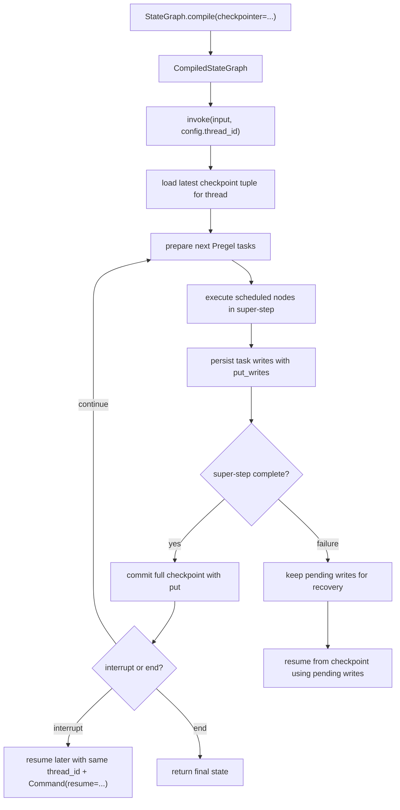

# LangGraph StateGraph compile invoke flow

## Summary

이 페이지는 `StateGraph.compile()`에서 `.invoke()`까지의 실행 흐름을 추적한다. 현재는 checkpointing 관점의 source path가 commit `aa322c13cd5f16a3f6254a931a4104e412cd687c` 기준으로 검증되었다.

핵심 요약: `StateGraph.compile(checkpointer=...)`는 `CompiledStateGraph` runnable을 만들고 checkpointer를 연결한다. 실행 시 `thread_id`가 있으면 LangGraph runtime은 super-step boundary마다 checkpoint를 저장하고, super-step 내부의 task writes도 저장해 interrupt, replay, pending-write recovery를 지원한다.

## Entry Point

```python
from typing import Annotated
from typing_extensions import TypedDict
from operator import add

from langgraph.graph import StateGraph, START, END
from langgraph.checkpoint.memory import InMemorySaver

class State(TypedDict):
    foo: str
    bar: Annotated[list[str], add]

def node_a(state: State):
    return {"foo": "a", "bar": ["a"]}

def node_b(state: State):
    return {"foo": "b", "bar": ["b"]}

workflow = StateGraph(State)
workflow.add_node(node_a)
workflow.add_node(node_b)
workflow.add_edge(START, "node_a")
workflow.add_edge("node_a", "node_b")
workflow.add_edge("node_b", END)

graph = workflow.compile(checkpointer=InMemorySaver())
config = {"configurable": {"thread_id": "1"}}
graph.invoke({"foo": "", "bar": []}, config)
```

Source: `langgraph-docs-persistence-2026-05-20`

## Call Path

### 1. `StateGraph.compile(checkpointer=...)`

**검증됨:** `compile()`은 `StateGraph`를 `CompiledStateGraph` runnable로 만든다. Reference 문서는 `checkpointer`를 graph의 versioned short-term memory로 설명하며, checkpointer가 있으면 invoke config에 `thread_id`를 전달해야 한다고 명시한다. Source: `langgraph-reference-stategraph-compile-2026-05-20`

**검증됨:** source 기준 `compile()`은 `ensure_valid_checkpointer()`를 거친 checkpointer를 `CompiledStateGraph(..., checkpointer=checkpointer, ...)`에 전달한다. 이후 `START`, nodes, edges, waiting edges, branches를 attach하고 `compiled.validate()`를 반환한다. `CompiledStateGraph`는 `Pregel`을 상속한다. Source: `langgraph-source-checkpoint-runtime-2026-05-20`

### 2. `CompiledStateGraph.invoke(input, config)`

**검증됨:** checkpointer 사용 시 `config["configurable"]["thread_id"]`가 thread key로 사용된다. 이 값이 없으면 checkpointer는 state 저장과 interrupt 이후 resume을 할 수 없다. Source: `langgraph-docs-persistence-2026-05-20`

**검증됨:** `Pregel._defaults()`가 effective checkpointer와 durability를 결정한다. `checkpointer=False`는 checkpointing을 끄고, config-level checkpointer override가 있으면 그것을 사용하며, root graph에서 `checkpointer=True`는 오류다. 기본 durability는 `"async"`다. Source: `langgraph-source-checkpoint-runtime-2026-05-20`

**검증됨:** sync 실행에서 `Pregel.stream()`은 `SyncPregelLoop`를 만들고, `PregelRunner`에 `put_writes=loop.put_writes`를 전달한다. 따라서 task output writes는 runner에서 loop의 `put_writes()`로 들어간다. Source: `langgraph-source-checkpoint-runtime-2026-05-20`

### 3. Super-step loop

**검증됨:** LangGraph는 super-step boundary마다 checkpoint를 생성한다. 한 super-step은 현재 예약된 node들이 실행되는 tick이며, node들은 병렬 실행될 수 있다. Source: `langgraph-docs-persistence-2026-05-20`

**검증됨:** source 기준 runtime loop는 `while loop.tick()` 안에서 cached writes를 출력하고, unfinished tasks를 runner로 실행한 뒤, `loop.after_tick()`을 호출한다. `after_tick()`은 `apply_writes()`로 task writes를 checkpoint에 적용하고 `_put_checkpoint({"source": "loop"})`를 호출한다. Source: `langgraph-source-checkpoint-runtime-2026-05-20`

**검증됨:** persistence timing은 실행 시 `durability` 옵션에 따라 달라진다. `"async"`는 기본값이다. `"sync"`는 tick 뒤 `_put_checkpoint_fut.result()`를 기다린다. `"exit"`는 `put_writes()`의 즉시 저장을 건너뛰고 loop exit 시 checkpoint와 pending writes를 저장한다. Source: `langgraph-docs-durable-execution-2026-05-20`, `langgraph-source-checkpoint-runtime-2026-05-20`

Sequential graph `START -> A -> B -> END`의 checkpoint sequence:

1. Empty checkpoint with `START` as next node
2. Input checkpoint with `node_a` as next node
3. `node_a` output checkpoint with `node_b` as next node
4. `node_b` output checkpoint with no next nodes

### 4. Task writes inside a super-step

**검증됨:** full checkpoint 외에도 node/task-level writes가 checkpointer에 저장된다. 한 super-step 안에서 일부 node가 성공하고 다른 node가 실패하면, 성공한 node의 writes를 pending writes로 재사용해 resume 시 성공 node를 다시 실행하지 않을 수 있다. Source: `langgraph-docs-persistence-2026-05-20`, `langgraph-reference-checkpoint-2026-05-20`

**검증됨:** `PregelLoop.put_writes()`는 writes를 `checkpoint_pending_writes`에 추가한다. `durability != "exit"`이고 saver가 있으면 `checkpointer.put_writes()`를 호출한다. Tick 시작 시 pending writes가 있고 replay 중이 아니면 `_reapply_writes_to_succeeded_nodes()`가 호출된다. Source: `langgraph-source-checkpoint-runtime-2026-05-20`

### 5. State inspection

**검증됨:** `graph.get_state(config)`는 최신 `StateSnapshot` 또는 특정 `checkpoint_id`의 snapshot을 반환한다. `graph.get_state_history(config)`는 thread의 checkpoint history를 최신순으로 반환한다. Source: `langgraph-docs-persistence-2026-05-20`

**검증됨:** source 기준 `get_state()`는 `checkpointer.get_tuple(config)`를 호출한 뒤 `_prepare_state_snapshot()`으로 `StateSnapshot`을 조립한다. 최신 checkpoint 조회에서는 pending writes를 적용한 snapshot을 만들 수 있다. `get_state_history()`는 `checkpointer.list()` 결과를 snapshot으로 변환한다. Source: `langgraph-source-checkpoint-runtime-2026-05-20`

### 6. Resume / replay

**검증됨:** interrupt resume은 같은 `thread_id`와 `Command(resume=...)`를 사용한다. LangGraph는 Python call stack의 같은 줄에서 계속하지 않고 적절한 시작점부터 replay한다. Graph API에서는 중단된 node의 시작점이 시작점이다. Source: `langgraph-docs-durable-execution-2026-05-20`

**검증됨:** 과거 `checkpoint_id`로 replay하면 checkpoint 이전 node는 skipped 처리되고 이후 node는 다시 실행된다. 이때 LLM call, API request, interrupt도 다시 발생할 수 있다. Source: `langgraph-docs-persistence-2026-05-20`

**검증됨:** source 기준 `_first()`는 기존 checkpoint의 `channel_versions`와 입력 형태(`None`, `Command`, same `run_id`, `CONFIG_KEY_RESUMING`)로 resume 여부를 판정한다. time-travel replay에서는 stale `RESUME` write를 제거하고 필요하면 `source="fork"` checkpoint를 만든다. Source: `langgraph-source-checkpoint-runtime-2026-05-20`

## Checkpoint Data Shape

Public `StateSnapshot` fields:

- `values` — state channel values
- `next` — next node names
- `config` — `thread_id`, `checkpoint_ns`, `checkpoint_id`
- `metadata` — `source`, node `writes`, `step`
- `created_at` — timestamp
- `parent_config` — previous checkpoint config
- `tasks` — scheduled tasks, errors, interrupts, optional subgraph snapshot

Source: `langgraph-docs-persistence-2026-05-20`

Source-level `Checkpoint` fields:

- `v`
- `id`
- `ts`
- `channel_values`
- `channel_versions`
- `versions_seen`
- `updated_channels`

Source: `langgraph-source-checkpoint-runtime-2026-05-20`

## Files Read

- `docs.langchain.com/oss/python/langgraph/persistence`
  - Purpose: official persistence behavior
  - Notes: threads, checkpoints, super-steps, pending writes, state history, replay
- `docs.langchain.com/oss/python/langgraph/durable-execution`
  - Purpose: resume semantics and deterministic replay guidance
  - Notes: resume does not continue from the same Python line
- `reference.langchain.com/python/langgraph/graph/state/StateGraph/compile`
  - Purpose: compile API contract
  - Notes: checkpointer as versioned short-term memory; `thread_id` requirement
- `reference.langchain.com/python/langgraph.checkpoint`
  - Purpose: checkpoint saver interface
  - Notes: `put`, `put_writes`, `get_tuple`, `list`, pending writes
- `github.com/langchain-ai/langgraph` commit `aa322c13cd5f16a3f6254a931a4104e412cd687c`
  - Purpose: source path orientation
  - Notes: `StateGraph.compile`, `Pregel.stream`, `PregelLoop`, `BaseCheckpointSaver`, `InMemorySaver`

## Source Code References

- Repo: `https://github.com/langchain-ai/langgraph`
- Commit: `aa322c13cd5f16a3f6254a931a4104e412cd687c`
- Local raw path: `docs/raw/official/langgraph/source/aa322c13cd5f16a3f6254a931a4104e412cd687c/`
- Files:
  - `libs/langgraph/langgraph/graph/state.py`
  - `libs/langgraph/langgraph/pregel/main.py`
  - `libs/langgraph/langgraph/pregel/_loop.py`
  - `libs/checkpoint/langgraph/checkpoint/base/__init__.py`
  - `libs/checkpoint/langgraph/checkpoint/memory/__init__.py`

## Tests

- TBD. 다음 단계에서 checkpoint tests를 찾아야 한다.

## Diagram



## Open Questions

- pending writes recovery를 검증하는 test file은 어디에 있는가?
- `libs/langgraph/langgraph/pregel/_checkpoint.py`는 `create_checkpoint`와 `channels_from_checkpoint`를 어떻게 구현하는가?
- `DeltaChannel`이 있을 때 `StateSnapshot.values`와 saver storage를 검증하는 test file은 어디에 있는가?

## Related Pages

- [[LangGraph]]
- [[StateGraph]]
- [[Checkpointing]]
- [[LangGraph Code Map]]

## Sources

- `langgraph-docs-persistence-2026-05-20`
- `langgraph-docs-durable-execution-2026-05-20`
- `langgraph-reference-stategraph-compile-2026-05-20`
- `langgraph-reference-checkpoint-2026-05-20`
- `langgraph-source-checkpoint-runtime-2026-05-20`
